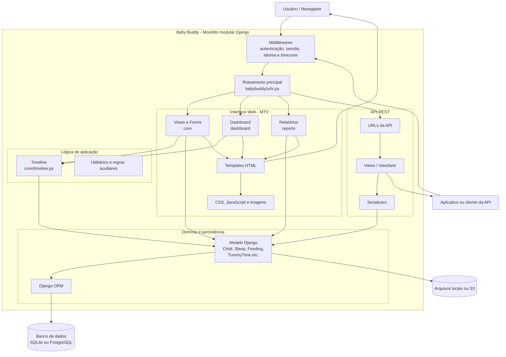

# Arquitetura do BabyBuddy

Por utilizar Django, a arquitetura do BabyBuddy pode ser descrita como um **monólito modular baseado em Django**, organizado segundo o padrão **MVT (Model-View-Template)**, semelhante ao conhecido **MVC (Model-View-Controller)**, utilizando também a API REST do **Django REST Framework**.

O software é implantado como uma única aplicação Django, com um único processo principal, configuração central e banco de dados compartilhado.

Seu código é dividido em módulos funcionais:

- `babybuddy`: configuração global, autenticação, middleware e roteamento;
- `core`: modelos e funcionalidades principais, como crianças, sono, alimentação e tummy time;
- `dashboard`: visualizações e consolidação de dados;
- `reports`: relatórios;
- `api`: endpoints REST.

Esses módulos aparecem como aplicações instaladas no `INSTALLED_APPS`, mas continuam compondo uma única aplicação implantável e compartilhando a mesma persistência.

Por isso, a classificação mais adequada é **monólito modular**, e não microsserviços.

O roteador principal também reúne as URLs da API, do core, do dashboard e dos relatórios em uma única aplicação Django.

---

# Arquitetura MVT

O padrão tradicional do Django é chamado de **MVT (Model-View-Template)**.

## Model

Representa os dados e as regras relacionadas à persistência.

Exemplos no BabyBuddy:

- `Child`
- `Sleep`
- `Feeding`
- `TummyTime`
- `DiaperChange`

Essas classes utilizam o Django ORM para consultar e persistir dados, por exemplo:

```python
Sleep.objects.filter(...)
Feeding.objects.create(...)
```

A camada **Model** se comunica com SQLite por padrão, mas o projeto permite configurar outros bancos por variáveis de ambiente, como PostgreSQL.

---

## Template

Representa a interface HTML entregue ao usuário.

Os templates do projeto ficam em diretórios como:

- `babybuddy/templates/`
- `core/templates/`
- `dashboard/templates/`
- `reports/templates/`

O Django está configurado para procurar templates tanto nos diretórios globais quanto dentro das aplicações instaladas.

---

## View

Recebe a requisição HTTP, executa a lógica necessária, consulta os modelos e devolve uma resposta.

Fluxo simplificado:

```text
URL
 ↓
View
 ↓
Model
 ↓
Template
 ↓
Resposta HTML
```

Apesar do nome **View**, no Django ela exerce uma função semelhante ao **Controller** do MVC tradicional.

---

# API REST

Além da interface HTML, o BabyBuddy oferece uma API REST.

Ela utiliza o **Django REST Framework** e possui configuração para:

- Autenticação por sessão;
- Autenticação por token;
- Filtros;
- Paginação;
- Permissões;
- Respostas JSON.

O fluxo da API é diferente do fluxo dos templates:

```text
Cliente REST
      ↓
URLs da API
      ↓
ViewSet / API View
      ↓
Serializer
      ↓
Model / ORM
      ↓
Banco de Dados
```

A API e a interface web utilizam os mesmos modelos e o mesmo banco de dados.

Isso reforça que o sistema é um **monólito modular**: existem duas formas de entrada, mas uma única base de domínio e persistência.

---

# Camadas da Arquitetura

Embora o projeto não implemente uma arquitetura em camadas rigorosa, é possível analisá-lo por meio das seguintes camadas conceituais.

## Camada de apresentação

Inclui:

- Templates HTML;
- CSS, JavaScript e SCSS;
- Formulários;
- Páginas do dashboard;
- Respostas JSON da API.

---

## Camada de controle e aplicação

Inclui:

- Views Django;
- URLs;
- ViewSets da API;
- Serializers;
- Funções de montagem da timeline;
- Autenticação;
- Middlewares.

É nessa camada que o arquivo `core/timeline.py` se encaixa.

Ele não é um Model nem um Template. Trata-se de um módulo de lógica de aplicação, pois consulta modelos e transforma os registros em eventos para apresentação.

---

## Camada de domínio e persistência

Inclui:

- Models Django;
- Validações de modelo;
- Relacionamentos;
- Managers e queries;
- Django ORM.

---

## Infraestrutura

Inclui:

- Banco de dados;
- Arquivos estáticos;
- Armazenamento local ou S3;
- Servidor WSGI;
- Middlewares;
- Configurações por variáveis de ambiente.

A documentação oficial mostra que a aplicação pode ser executada com servidor web, servidor de aplicação Python e banco de dados, além de suportar diferentes formas de implantação.

---

# Vantagens

- Estrutura convencional e bem suportada pelo Django;
- Implantação mais simples do que microsserviços;
- Reutilização dos mesmos modelos pela interface web e API;
- Separação funcional por aplicações;
- Facilidade para desenvolvimento e testes locais.

---

# Limitações

- Algumas regras de aplicação ficam misturadas às views ou módulos auxiliares;
- Módulos compartilham diretamente os mesmos models;
- Alterações em uma área podem afetar outras partes do monólito;
- Não existe isolamento de implantação entre `core`, `dashboard`, `reports` e `api`;
- Funções como a timeline podem concentrar consultas, transformação e apresentação no mesmo módulo.

---

# Diagrama

## Diagrama da arquitetura


