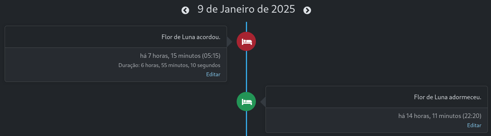
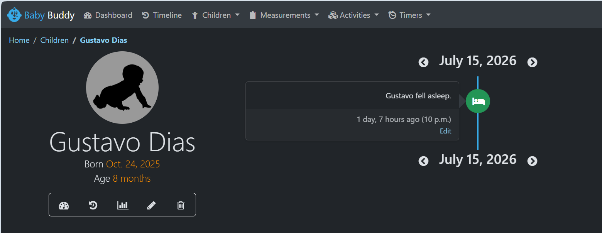
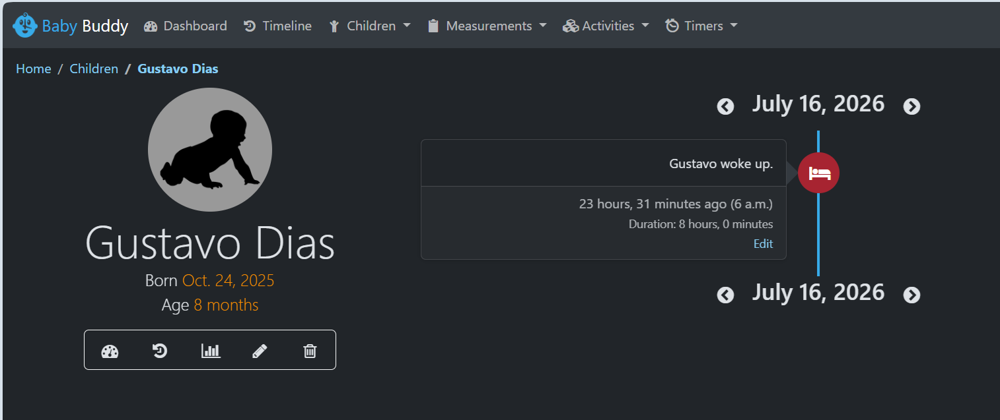

# Issue escolhida: 

https://github.com/babybuddy/babybuddy/issues/942

## Resolução da Issue #942

## Problema observado

Foi identificado um bug relatado por outro usuário no qual, ao cadastrar uma soneca que se iniciava em um dia e terminava no dia seguinte (por exemplo, **13/04/2026 23:50:00** até **14/04/2026 01:20:00**), a timeline exibia apenas a data de início da atividade, dando a impressão de que a criança havia iniciado e finalizado a soneca no mesmo dia.

Esse comportamento fazia com que eventos com duração atravessando a meia-noite fossem apresentados de forma incorreta, comprometendo a visualização cronológica das atividades.

---



## Solução

A solução implementada consistiu em tornar a lógica de consulta e montagem da timeline mais robusta, permitindo tratar corretamente eventos cuja duração abrange mais de um dia.

### Utilização do objeto `Q`

Inicialmente, foi importado o objeto `Q` do Django ORM.

O objeto `Q` permite criar consultas mais complexas utilizando operadores lógicos como:

- **AND (`&`)**
- **OR (`|`)**
- **NOT (`~`)**

Com isso, foi possível modificar as consultas para que retornassem atividades cujo horário de **início** ou **término** estivesse dentro do período correspondente ao dia exibido na timeline.

---

### Função `_is_in_range`

Também foi criada a função auxiliar `_is_in_range`.

Sua responsabilidade é verificar se um determinado horário pertence ao intervalo correspondente ao dia atualmente exibido na timeline.

Por exemplo:

```text
Data exibida:
13/04/2026

min_date = 13/04/2026 00:00:00
max_date = 13/04/2026 23:59:59

start = 13/04/2026 23:50:00
end   = 14/04/2026 01:20:00
```

Nesse cenário:

- `_is_in_range(start)` retorna **True**;
- `_is_in_range(end)` retorna **False**.

Como consequência, apenas o evento de início será exibido na timeline do dia **13/04**, enquanto o evento de término será apresentado na timeline do dia **14/04**.

---

### Função `_duration_instances_for_day`

Outra melhoria foi a criação da função `_duration_instances_for_day`.

Essa função é responsável por organizar cronologicamente os eventos com duração registrados na timeline, ordenando-os por horário e pela criança associada ao registro.

Essa organização facilita a exibição correta dos eventos e evita inconsistências durante a construção da timeline diária.

---

## Alterações na classe `TummyTime`

A lógica da classe **TummyTime** também foi modificada.

Antes da correção, tanto o horário de início quanto o horário de término eram adicionados à timeline sem verificar se cada um realmente pertencia ao dia exibido.

Após a alteração, cada horário é validado individualmente utilizando a função `_is_in_range`.

Assim:

- se apenas o início ocorreu no dia atual, somente ele será exibido;
- se o término ocorrer apenas no dia seguinte, ele aparecerá apenas na timeline desse outro dia.

Essa mudança garante que cada evento seja exibido exatamente no dia em que ocorreu.

---

## Alterações nas classes `Sleep` e `Feeding`

A mesma lógica aplicada em **TummyTime** foi implementada nas classes **Sleep** e **Feeding**.

As consultas passaram a utilizar a função `_is_in_range` para validar individualmente os horários de início e término de cada atividade.

Com isso, eventos que atravessam a meia-noite passaram a ser representados corretamente, eliminando a inconsistência observada na issue #942.

---

# Resultado

Após a implementação das alterações:

- eventos com duração passaram a ser exibidos corretamente na timeline;
- atividades iniciadas em um dia e finalizadas no seguinte deixaram de aparecer integralmente em apenas um dos dias;
- a ordenação cronológica dos eventos tornou-se consistente;
- a visualização da timeline passou a refletir corretamente a ocorrência real das atividades.

A correção resolveu o problema relatado na **issue #942** e tornou a lógica de construção da timeline mais robusta para cenários envolvendo eventos com duração distribuída entre dias diferentes.




# Descrição da refatoração

# Padrões e Code Smells

Durante a análise da arquitetura do BabyBuddy, foram identificados três *code smells* na implementação da timeline. Esses problemas afetam a manutenibilidade, legibilidade e evolução do código.

---

# Code Smell 1 – Código duplicado

As funções responsáveis pela criação dos eventos da timeline para **Sleep**, **TummyTime** e **Feeding** repetem grande parte da mesma lógica. Também existe repetição na criação dos eventos de início e fim.

## Problema

Essa duplicação:

- Aumenta o tamanho do arquivo;
- Torna mudanças mais arriscadas;
- Facilita inconsistências;
- Obriga o desenvolvedor a alterar vários trechos para modificar a estrutura de um evento.

Foi exatamente esse tipo de duplicação que contribuiu para o bug da **issue #942**: os eventos de início e fim eram adicionados de forma semelhante, mas sem validação individual consistente.

Esse *code smell* está relacionado ao princípio **DRY (Don't Repeat Yourself)**.

## Possível solução

Extrair uma função responsável pela construção dos eventos, centralizando a lógica comum e reduzindo a duplicação de código.

---

# Code Smell 2 – Função longa e múltiplas responsabilidades

A função `_add_feedings` executa diversas tarefas diferentes:

- Consulta o banco de dados;
- Busca registros do dia anterior;
- Calcula `time_since_prev`;
- Filtra atividades;
- Formata detalhes;
- Cria links;
- Diferencia alimentações pontuais e alimentações com duração;
- Cria eventos de início;
- Cria eventos de término;
- Calcula duração;
- Adiciona os eventos à lista final.

## Problema

Essa função possui baixa coesão e viola o **Single Responsibility Principle (SRP)**.

Uma alteração no cálculo do tempo, na estrutura dos eventos ou na consulta ao banco exige modificar a mesma função.

Isso aumenta:

- Complexidade;
- Dificuldade de leitura;
- Dificuldade de testes;
- Risco de regressões.

## Possível solução

Dividir a implementação em funções menores, deixando uma função principal apenas como coordenadora do fluxo de execução.

Essa abordagem melhora significativamente a legibilidade, manutenção e testabilidade.

---

# Code Smell 3 – Uso excessivo de dicionários não tipados

Os eventos da timeline são representados por dicionários livres (*dict*).

Como consequência, o Python não garante que todos possuam a mesma estrutura.

Isso pode causar problemas como:

- utilização de nomes diferentes para a mesma chave (`event_type` e `type`);
- ausência de campos obrigatórios;
- utilização de tipos incorretos para determinados valores.

Esse *code smell* pode ser classificado como **Primitive Obsession** ou **Data Clump**.

## Possível solução

Utilizar **TypedDict** para definir explicitamente a estrutura esperada dos eventos.

Com isso, torna-se possível:

- definir um contrato para os dicionários;
- facilitar a detecção de erros por ferramentas de análise estática;
- melhorar o suporte oferecido pelos editores de código;
- reduzir inconsistências durante o desenvolvimento.

---

# Padrões de Projeto Aplicados

Como parte da refatoração, foram aplicados dois padrões de projeto para melhorar a organização e a manutenção da implementação da timeline.

## Builder Pattern

O padrão **Builder** foi utilizado para centralizar a criação dos eventos da timeline.

### Benefícios

- Redução da duplicação de código;
- Padronização da estrutura dos eventos;
- Facilidade para manutenção;
- Maior reutilização da lógica de construção.

---

## Strategy Pattern

O padrão **Strategy** foi utilizado para separar a lógica de processamento de cada tipo de evento da timeline.

Cada estratégia passou a encapsular o comportamento específico de um tipo de atividade.

### Benefícios

- Redução das responsabilidades concentradas em uma única função;
- Maior coesão;
- Facilidade para adicionar novos tipos de eventos;
- Melhor aderência ao princípio **Open/Closed**.

---

# Resultado da Refatoração

A aplicação dos padrões Builder e Strategy permitiu:

- reduzir a duplicação de código;
- melhorar a organização da lógica da timeline;
- facilitar testes e manutenção;
- aumentar a legibilidade do código;
- tornar a implementação mais extensível para futuras funcionalidades.

# PR's criados

### PR1 - Arquitetura: https://github.com/babybuddy/babybuddy/pull/1094

### PR2 - Padrões: https://github.com/babybuddy/babybuddy/pull/1092

### PR3 - Refatoração: https://github.com/babybuddy/babybuddy/pull/1090

### PR4 - Testes: https://github.com/babybuddy/babybuddy/pull/1091

### PR5 - DevOps: https://github.com/babybuddy/babybuddy/pull/1093

### PR6 - Issue resolvida: https://github.com/babybuddy/babybuddy/pull/1088

# Papel de cada integrante

Todo o trabalho foi desenvolvido por Gustavo Guimarães de Oliveira Dias - 22.2.8020
